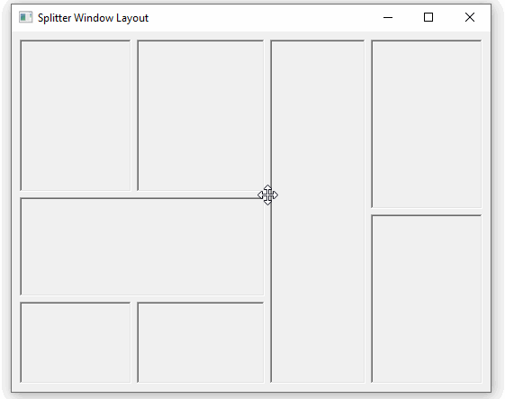

# splitter-layout-win32

This project illustrates an approach to splitter-based UI layouts, with an example win32 implementation written in C++.

The approach is described in more detail here:
https://kurtjm.com/blog/programming/2020/08/01/splitter-window-layouts.html
